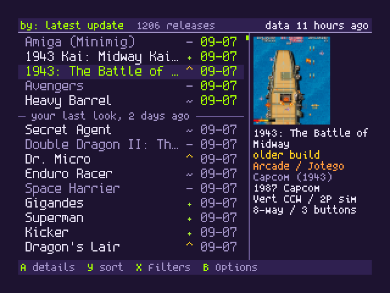
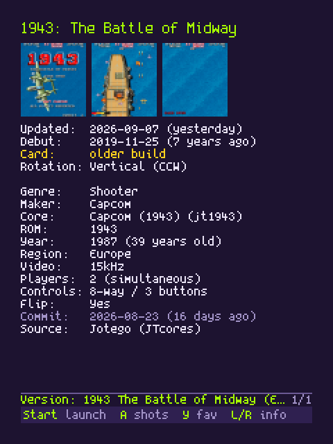
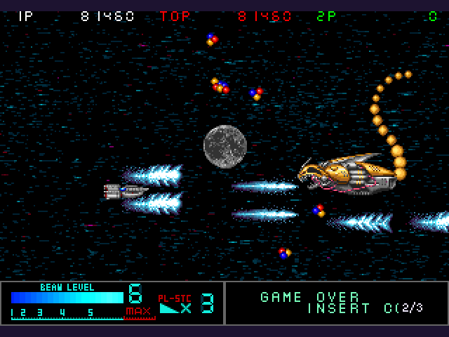
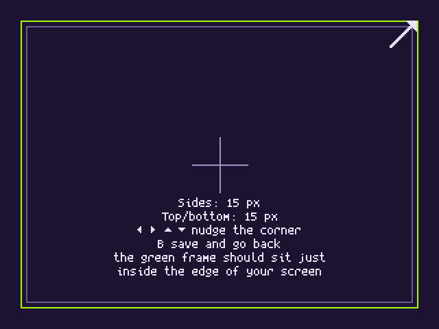
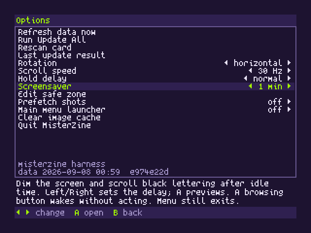
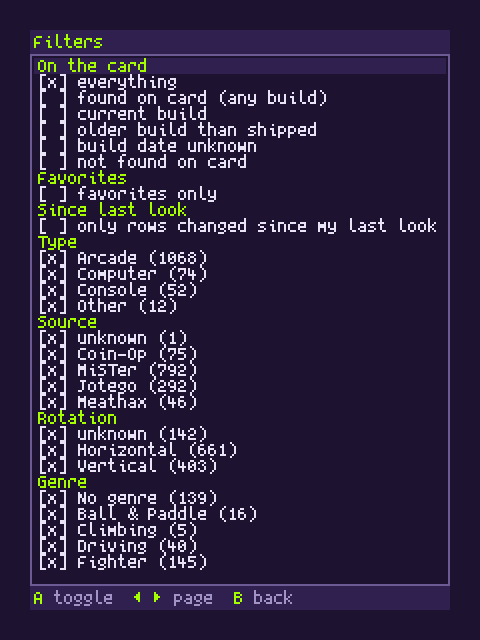

# MisterZine for MiSTer

These instructions describe v1.0.0, currently in preparation. For the published
v0.2.1 setup, see [that version's README](https://github.com/matijaerceg/misterzine-on-device/blob/v0.2.1/README.md).

See what's new, check what's on your card, and launch a game from the
MiSTer main menu. MisterZine brings the [release tracker](https://misterzine.fyi)
to your display, with screenshots, favorites, filters, and keyboard search.

It follows new releases and updated builds across the catalogue. The interface
uses a 320x240 framebuffer, with horizontal and rotated CRT layouts.

  
  
  
  
  
  

## Install once

You need a current MiSTer system with Downloader (usually run through Update All).
MisterZine uses MiSTer's framebuffer console, enabled by default. Only change
`fb_terminal` in MiSTer.ini if you previously set it to `0`; it needs to be `1`.

**Choose HDMI or CRT for MisterZine's interface.** It does not currently mirror
to a normal HDMI display and a 15 kHz CRT at their separate resolutions.
Game cores keep their own display settings. For CRT setup or switching outputs,
see [display setup](docs/TROUBLESHOOTING.md#display-setup).

1. Download [downloader_misterzine.ini](https://github.com/matijaerceg/misterzine-on-device/releases/latest/download/downloader_misterzine.ini).
2. Copy it to the root of your SD card, beside `downloader.ini`.
3. Run Update All or Downloader.
4. Run **MisterZine Setup** from Scripts once.
5. Return to the main menu and choose **MisterZine**.

**After setup, open MisterZine directly from the main menu.** Its launcher
starts automatically at boot. You do not need to visit Scripts each time.
Updates arrive through your normal Update All/Downloader runs.

If you already enabled the launcher in an earlier version, it stays enabled.
For configuration by hand, see [installation details](docs/USER_GUIDE.md#installation).

## Everyday controls

| Button | In the list |
|---|---|
| Up/Down | Move; hold to scroll |
| Left/Right | Page |
| L/R | Jump to first/last |
| A | Open details |
| Start | Launch the main version |
| X | Filters |
| Y | Sort by latest update or MiSTer debut |
| B | Options |
| Menu | Return to MiSTer's main menu |

In Details, Up/Down chooses a version, **Start launches it**, A opens artwork,
L/R scrolls information, and Y toggles a favorite. B goes back.

Type a title on a keyboard to find it. Backspace edits; B/Esc clears the search.
Filter choices are remembered between visits. Search text is temporary.

The app checks for new catalogue data on launch and every 30 minutes. Cached
data and pictures remain available without a connection.

After one minute idle, a screensaver dims the picture and sweeps full-height
black **MISTERZINE** lettering across it. Change the delay or turn it off in
Options; press A on that setting to preview it.

## Remove

Quit MisterZine, then run **MisterZine Uninstall** from Scripts. Choose to keep
favorites and preferences, or remove everything. The helper removes the
main-menu launcher and Downloader registration as well as the app.

See the [user guide](docs/USER_GUIDE.md#removal) for what is kept and how to
reinstall. Removal requires a current Downloader with uninstall support.

## More information

- [User guide](docs/USER_GUIDE.md): controls, Options, Update All, installation and removal.
- [Troubleshooting](docs/TROUBLESHOOTING.md): display setup, launching and saved data.
- [Development](docs/DEVELOPMENT.md): builds, tests, screenshots and opt-in debugging.
- [Changelog](CHANGELOG.md) and [release procedure](docs/RELEASING.md).

## Thanks and licenses

Thanks to the MiSTer community and core developers, the
[Downloader](https://github.com/MiSTer-devel/Downloader_MiSTer) and
[Update All](https://github.com/theypsilon/Update_All_MiSTer) maintainers,
and [Frederic Cambus](https://www.cambus.net/spleen-monospaced-bitmap-fonts/)
for the Spleen bitmap fonts.

Code: [MIT](LICENSE). Fonts: [BSD-2-Clause](internal/fonts/SPLEEN-LICENSE).
Catalogue: MiSTerZine by Matija Erceg, CC BY 4.0.
Screenshots and hardware photos retain their owners' rights; see the
[website's image credits](https://github.com/matijaerceg/misterzine#the-image-pipeline-tools).
The installation includes [third-party notices](deploy/THIRD-PARTY-NOTICES.txt).
