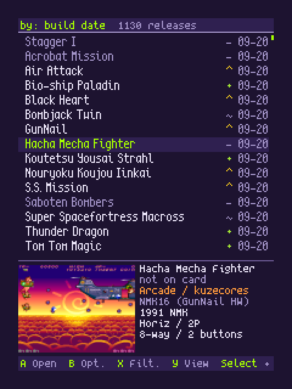
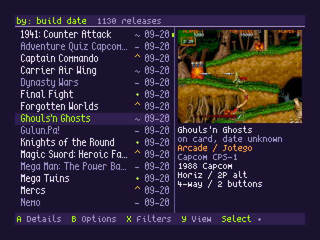
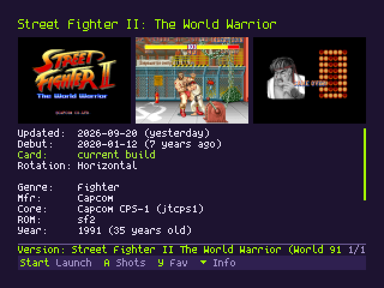
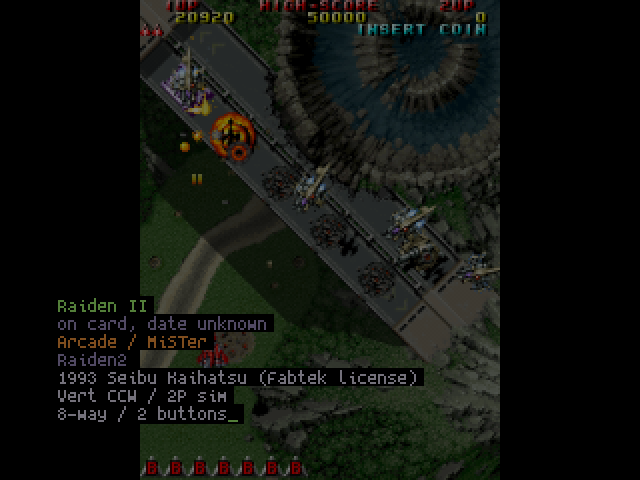
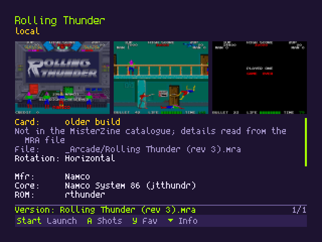

# MisterZine Frontend for MiSTer

An arcade-first frontend for MiSTer. Browse games, follow new releases,
see what's on your card, and launch straight into play from the MiSTer main menu. MisterZine brings the [release tracker](https://misterzine.fyi)
to your display, with screenshots, favorites, filters, and keyboard search.

<video src="https://github.com/user-attachments/assets/4fb458ba-5adf-4f02-aec2-c5af51a0eaa1" controls muted></video>

Every frame above is the app itself, at 30 fps. The same tour runs at
[1080p60 on YouTube](https://www.youtube.com/watch?v=vplqOaqzo9A).

Arcade games are shown by default. Enable **Options > List > Show non-arcade
cores** to include console, computer and other cores for browsing and tracking
updates. Favorites are kept when their cores are hidden. Arcade games on your
card that the catalogue does not list show up too, marked "local", with their
details read from the MRA file.

It follows new releases and updated builds across the enabled catalogue. The interface
uses a 320x240 framebuffer, with horizontal and rotated CRT layouts.

  
  
  
  
  
  
  
  
  
  
  

## Install once

You need a current MiSTer system with Downloader (usually run through Update All).
MisterZine uses MiSTer's framebuffer console, enabled by default. Only change
`fb_terminal` in MiSTer.ini if you previously set it to `0`; it needs to be `1`.

**Choose HDMI or CRT for MisterZine's interface.** It does not currently mirror
to a normal HDMI display and a 15 kHz CRT at their separate resolutions.
Game cores keep their own display settings. The choice can cover the whole
MiSTer menu or MisterZine alone, so an HDMI display can keep the menu and the
terminal while the CRT shows MisterZine. For CRT setup or switching outputs,
see [display setup](docs/TROUBLESHOOTING.md#display-setup). A MiSTercade or
other JAMMA cabinet needs one extra INI section, described under
[JAMMA cabinets](docs/TROUBLESHOOTING.md#jamma-cabinets-mistercade).

1. Download [downloader_misterzine.ini](https://github.com/matijaerceg/misterzine-on-device/releases/latest/download/downloader_misterzine.ini).
2. Copy it to the root of your SD card, beside `downloader.ini`.
3. Run Update All or Downloader.
4. Run **MisterZine-Setup** from Scripts once.
5. Return to the main menu and choose **MisterZine**.

**After setup, open MisterZine directly from the main menu.** Its launcher
starts automatically at boot. You do not need to visit Scripts each time.
Updates arrive through your normal Update All/Downloader runs.

If you already enabled the launcher in an earlier version, it stays enabled.

If another frontend is your main menu (Degauss), choose **MisterZine-Run** in
its Scripts list, or exit to the MiSTer menu and choose MisterZine there.
For configuration by hand, see [installation details](docs/USER_GUIDE.md#installation).

## Everyday controls

| Button | In the list |
|---|---|
| Up/Down | Move; hold to scroll |
| Left/Right | Page |
| L/R | Jump to first/last |
| A | Open details |
| Start | Launch the main version |
| X | Filters |
| Y | Cycle latest update, MiSTer debut, alphabetical, and Favorites |
| B | Options |
| Menu | Return to MiSTer's main menu |

In Details, Up/Down chooses a version, **Start launches it**, A opens artwork,
L/R scrolls information, and Y toggles a favorite. B goes back.

Type a title on a keyboard to find it. Backspace edits; B/Esc clears the search.
Filter choices are remembered between visits. Search text is temporary.

The app checks for new catalogue data on launch and every 30 minutes. Cached
data and pictures remain available without a connection.

After one minute idle, a screensaver dims the picture and sweeps full-height
black **MISTERZINE** lettering, with glinting chrome edges, across it. Change the delay or turn it off in
Options -> Screensaver; Preview starts it immediately. The Screenshots style shows
random arcade screenshots instead, each wiping in behind a soft edge; hold
Start for two seconds on one to play that game. Combine filters for games on the card, current rotation, favorites and original resolution.

## Remove

Quit MisterZine, then run **MisterZine-Uninstall** from Scripts. Choose to keep
favorites and preferences, or remove everything. The helper removes the
main-menu launcher and Downloader registration as well as the app.

See the [user guide](docs/USER_GUIDE.md#removal) for what is kept and how to
reinstall. Removal requires a current Downloader with uninstall support.

## More information

- [User guide](docs/USER_GUIDE.md): controls, Options, Update All, installation and removal.
- [Troubleshooting](docs/TROUBLESHOOTING.md): display setup, launching and saved data.
- [Development](docs/DEVELOPMENT.md): builds, tests, screenshots and opt-in debugging.
- [Changelog](CHANGELOG.md) and [release procedure](docs/RELEASING.md).

## Thanks and licenses

Thanks to the MiSTer community and core developers, the
[Downloader](https://github.com/MiSTer-devel/Downloader_MiSTer) and
[Update All](https://github.com/theypsilon/Update_All_MiSTer) maintainers,
[Frederic Cambus](https://www.cambus.net/spleen-monospaced-bitmap-fonts/)
for the Spleen bitmap fonts, and [Akshay Oppiliappan](https://github.com/oppiliappan/scientifica)
for scientifica, the narrow title font.

Code: [MIT](LICENSE). Fonts: Spleen [BSD-2-Clause](internal/fonts/SPLEEN-LICENSE),
scientifica [SIL OFL 1.1](internal/fonts/SCIENTIFICA-LICENSE).
Catalogue: MiSTerZine by Matija Erceg, under the [MiSTerZine Catalogue Licence](LICENSE-CATALOGUE):
CC BY 4.0 terms plus a source neutrality condition, so consumers must not by default
hide or single out entries by database or installed status.
Screenshots and hardware photos retain their owners' rights; see the
[website's image credits](https://github.com/matijaerceg/misterzine#the-image-pipeline-tools).
The installation includes [third-party notices](deploy/THIRD-PARTY-NOTICES.txt).
